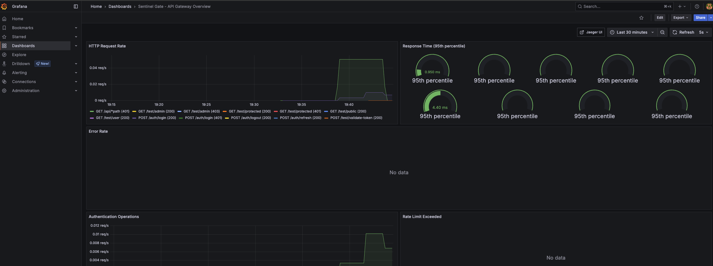
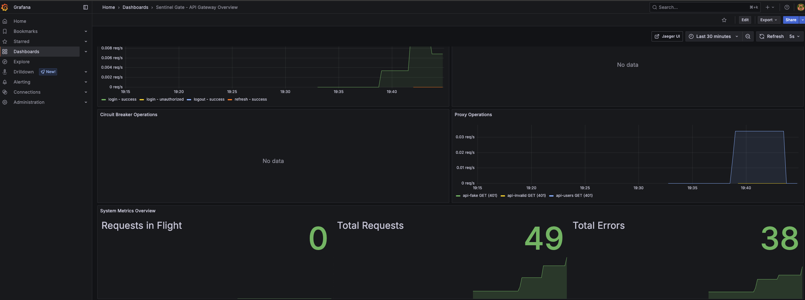
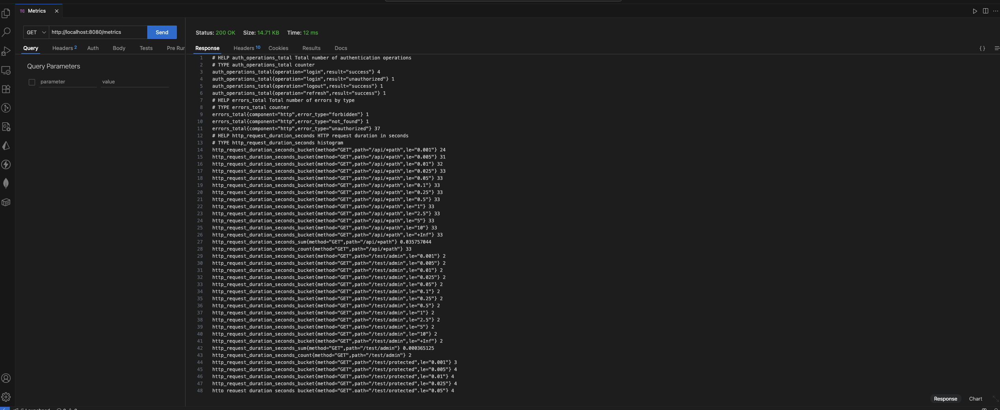
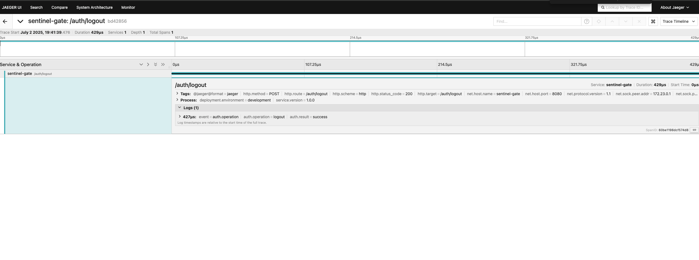
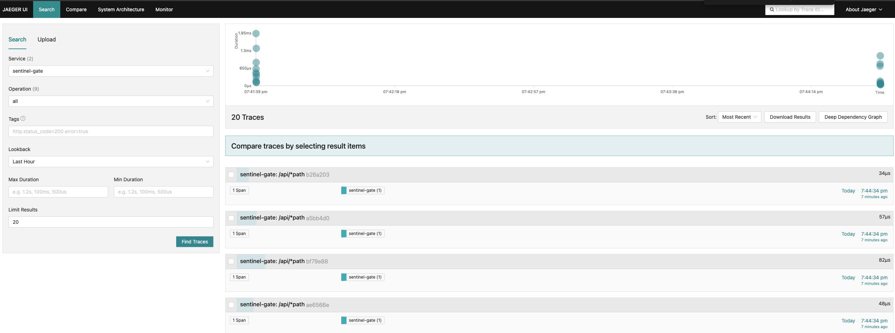
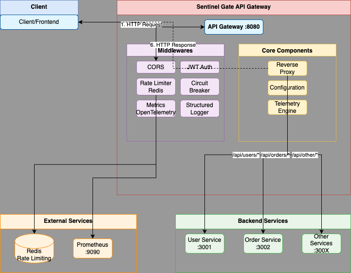

🛡️ Sentinel Gate - API Gateway

<div align="center">


<div data-badges>
  
  
  
</div>

<div data-badges>
  
  
  
  
  
  
  
  
</div>
</div>

O Sentinel Gate é um API Gateway robusto e performático desenvolvido em Go, oferecendo uma solução completa para arquiteturas de microserviços:

✔ **Autenticação JWT** com refresh automático e controle de acesso baseado em roles

✔ **Rate Limiting** distribuído com Redis para proteção contra DDoS e abuse

✔ **Circuit Breaker** inteligente para prevenção de falhas em cascata

✔ **Observabilidade completa** com OpenTelemetry, Prometheus e Grafana

✔ **Reverse Proxy** de alta performance com roteamento inteligente

✔ **Logs estruturados** e métricas detalhadas para monitoring avançado

Desenvolvido com Go, Gin Framework e Redis, o sistema garante alta performance, resiliência e observabilidade completa para ambientes de produção.

## 🖥️ Como rodar este projeto 🖥️

### Requisitos:

- [Go 1.21+](https://golang.org/doc/install) instalado
- [Docker & Docker Compose](https://docs.docker.com/get-docker/) instalado
- Redis 6.0+ (ou via Docker)

### Execução:

1. Clone este repositório:

   ```sh
   git clone https://github.com/lorenaziviani/sentinel_gate.git
   ```

2. Acesse o diretório do projeto:

   ```sh
   cd sentinel_gate
   ```

3. Instale as dependências:

   ```sh
   go mod download
   ```

4. Configure as variáveis de ambiente:

   ```sh
   cp configs/env.example .env
   ```

   Edite o arquivo `.env` com suas configurações específicas.

5. Inicie todos os serviços com Docker Compose (recomendado):

   ```sh
   docker-compose up -d
   ```

6. Ou execute localmente:

   ```sh
   # Inicie o Redis
   docker run -d --name redis -p 6379:6379 redis:alpine

   # Execute o gateway
   go run cmd/gateway/main.go
   ```

7. Acesse os serviços:
   - **Gateway**: [http://localhost:8080](http://localhost:8080)
   - **Grafana**: [http://localhost:3000](http://localhost:3000) (admin/admin123)
   - **Prometheus**: [http://localhost:9090](http://localhost:9090)
   - **Jaeger**: [http://localhost:16686](http://localhost:16686)

## 🗒️ Features do projeto 🗒️

🔐 **Segurança & Autenticação**

- **JWT Authentication**
  - Login/logout com tokens stateless
  - Refresh automático de tokens
  - Controle de acesso baseado em roles (admin/user)
  - Validação rigorosa de tokens e claims
- **Rate Limiting**
  - Proteção por IP com Redis distribuído
  - Configuração flexível (RPM, burst, janelas de tempo)
  - Headers informativos para clientes
- **CORS & Validation**
  - Configuração segura para requisições cross-origin
  - Validação de headers e payloads

🚀 **Performance & Resiliência**

- **Circuit Breaker**
  - Proteção contra falhas em cascata
  - Estados: CLOSED → OPEN → HALF-OPEN
  - Fallback automático com headers informativos
  - Métricas de sucesso/falha por serviço
- **Reverse Proxy**
  - Roteamento inteligente para backends
  - Load balancing interno
  - Timeouts configuráveis
  - Health checks contínuos

📊 **Observabilidade Completa**

- **Métricas (Prometheus)**
  - HTTP requests, latência, throughput
  - Rate limiting e circuit breaker metrics
  - Métricas de autenticação e proxy
  - Integração com Grafana dashboards
- **Distributed Tracing (Jaeger)**
  - Rastreamento end-to-end de requisições
  - Correlação entre microserviços
  - Performance insights detalhados
- **Structured Logging**
  - Logs JSON estruturados com Zap
  - Request IDs para correlação
  - Múltiplos níveis de log

🛠️ **Administração & Testes**

- **Admin Endpoints**
  - Status de circuit breakers
  - Métricas em tempo real
  - Reset manual de circuit breakers
  - Health checks detalhados
- **Testing Suite**
  - Testes automatizados via Makefile
  - Scripts de teste para JWT, Rate Limiting e Circuit Breaker
  - Testes de integração completos
  - Benchmarks de performance

## 🔧 Comandos de Teste 🔧

```bash
# Rodar todos os testes
make test-all

# Testes específicos
make test-jwt              # Autenticação JWT
make test-rate-limit       # Rate Limiting
make test-circuit-breaker  # Circuit Breaker

# Testes de integração
make test-integration

# Ver todos os comandos disponíveis
make help
```

## 📈 Monitoramento e Dashboards 📈

### Grafana Dashboard

Acesse [http://localhost:3000](http://localhost:3000) com **admin/admin123** para ver:

- Taxa de requisições HTTP em tempo real
- Latência P95 e throughput
- Taxa de erro e operações de autenticação
- Métricas de rate limiting e circuit breaker
- Operações de proxy e métricas de sistema





### Prometheus Metrics

Acesse [http://localhost:9090](http://localhost:9090) para monitorar:

- Métricas em tempo real do Gateway
- Targets e endpoints sendo coletados
- Queries customizadas para análise
- Alertas e rules configuradas



### Jaeger Tracing

Acesse [http://localhost:16686](http://localhost:16686) para visualizar:

- Traces distribuídos entre serviços
- Latência de operações individuais
- Dependency graphs automáticos
- Performance bottlenecks





## 🌐 Endpoints da API 🌐

### Autenticação

```bash
# Login
POST /auth/login
Content-Type: application/json
{
  "username": "admin",
  "password": "password123"
}

# Refresh Token
POST /auth/refresh
Content-Type: application/json
{
  "refresh_token": "eyJhbGciOiJIUzI1NiIs..."
}

# Logout
POST /auth/logout
Authorization: Bearer <token>
```

### Proxy Routes

```bash
# Usuários (requer autenticação)
GET /api/users
Authorization: Bearer <token>

# Pedidos (requer autenticação)
GET /api/orders
Authorization: Bearer <token>
```

### Administração

```bash
# Health Check
GET /health

# Readiness Check
GET /ready

# Métricas Prometheus
GET /metrics

# Status Circuit Breakers
GET /admin/circuit-breaker/status

# Reset Circuit Breaker
POST /admin/circuit-breaker/reset/:service
```

## 🏗️ Arquitetura do Sistema 🏗️

<div align="center">

</div>

```
Cliente → CORS → Logger → Metrics → Rate Limit → JWT Auth → Circuit Breaker → Reverse Proxy → Backend Services
```

**Fluxo detalhado:**

1. **CORS**: Validação de origem e headers
2. **Logging**: Registro estruturado da requisição
3. **Metrics**: Coleta de métricas de performance
4. **Rate Limiting**: Verificação de limites por IP
5. **JWT Auth**: Validação de token e extração de claims
6. **Circuit Breaker**: Verificação de saúde do backend
7. **Reverse Proxy**: Roteamento para serviço apropriado

## 💎 Links úteis 💎

- [Go Documentation](https://golang.org/doc/)
- [Gin Framework](https://gin-gonic.com/docs/)
- [Redis Documentation](https://redis.io/documentation)
- [Prometheus](https://prometheus.io/docs/)
- [Grafana](https://grafana.com/docs/)
- [OpenTelemetry Go](https://opentelemetry.io/docs/instrumentation/go/)
- [JWT Best Practices](https://auth0.com/blog/a-look-at-the-latest-draft-for-jwt-bcp/)
