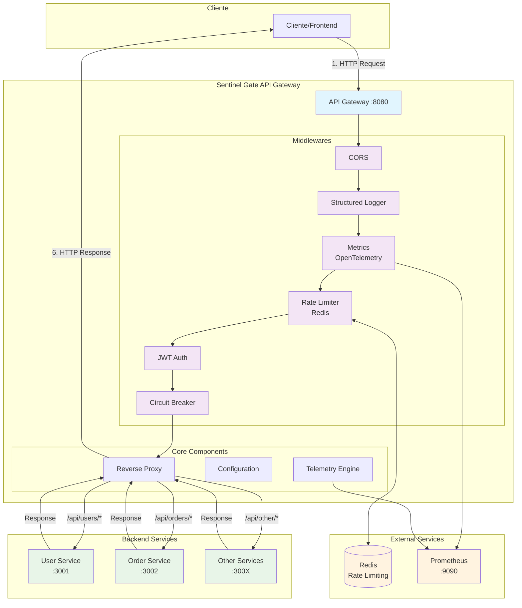

# Arquitetura do Sentinel Gate

## Visão Geral

O Sentinel Gate é um API Gateway desenvolvido em Go que oferece funcionalidades avançadas de segurança, performance e observabilidade para arquiteturas de microserviços.

## Diagrama de Arquitetura

## Fluxo de Requisição

### 1. Entrada da Requisição

- Cliente envia requisição HTTP para o API Gateway na porta `:8080`
- Gateway recebe e inicia o pipeline de middlewares

### 2. Pipeline de Middlewares

#### 2.1 CORS (Cross-Origin Resource Sharing)

- Configura headers CORS para permitir requisições cross-origin
- Trata requisições OPTIONS (preflight)

#### 2.2 Structured Logger

- Registra todas as requisições com informações estruturadas
- Inclui método, path, IP do cliente, user agent, latência

#### 2.3 Metrics (OpenTelemetry)

- Coleta métricas de performance em tempo real
- Contador de requisições, histograma de latência, conexões ativas
- Exporta métricas para Prometheus

#### 2.4 Rate Limiter

- Implementa controle de taxa usando Redis
- Algoritmo sliding window para controle preciso
- Bloqueia clientes que excedem o limite configurado

#### 2.5 JWT Authentication

- Valida tokens JWT em todas as rotas protegidas
- Extrai informações do usuário (ID, username, role)
- Adiciona claims ao contexto da requisição

#### 2.6 Circuit Breaker

- Protege contra falhas em cascata
- Monitora taxa de erro dos serviços backend
- Implementa estados: Fechado, Aberto, Meio-Aberto

### 3. Reverse Proxy

- Roteia requisições para serviços backend baseado no path
- Adiciona headers de contexto (X-User-ID, X-Username, etc.)
- Implementa load balancing e health checks

### 4. Serviços Backend

- Recebem requisições já autenticadas e validadas
- Processam a lógica de negócio específica
- Retornam respostas para o gateway

### 5. Resposta

- Gateway retorna resposta do backend para o cliente
- Inclui headers de tracking (X-Request-ID)
- Registra métricas de resposta

## Componentes Principais

### Gateway Core

- **Server**: Servidor HTTP principal usando Gin framework
- **Configuration**: Sistema de configuração baseado em variáveis de ambiente
- **Graceful Shutdown**: Desligamento elegante com timeout configurável

### Segurança

- **JWT Authentication**: Autenticação stateless com tokens JWT
- **Rate Limiting**: Proteção contra ataques DDoS e uso abusivo
- **CORS**: Configuração segura para requisições cross-origin

### Observabilidade

- **Structured Logging**: Logs estruturados usando Zap
- **Metrics**: Métricas Prometheus via OpenTelemetry
- **Request Tracing**: Rastreamento de requisições com Request ID

### Resiliência

- **Circuit Breaker**: Proteção contra falhas em cascata
- **Health Checks**: Monitoramento da saúde dos serviços backend
- **Retry Logic**: Tentativas automáticas em caso de falha

## Tecnologias Utilizadas

- **Go 1.21**: Linguagem principal
- **Gin**: Framework web de alta performance
- **Redis**: Cache e rate limiting
- **OpenTelemetry**: Observabilidade e métricas
- **Prometheus**: Coleta e armazenamento de métricas
- **JWT**: Autenticação stateless
- **Zap**: Logging estruturado de alta performance

## Configuração

O gateway é configurado via variáveis de ambiente, permitindo fácil deployment em containers e diferentes ambientes.

### Principais Configurações

- **Server**: Porta, timeouts, modo de execução
- **Redis**: Conexão para rate limiting
- **JWT**: Secret, expiração, issuer
- **Rate Limiting**: Requests por minuto, janela de tempo
- **Telemetry**: Ativação, porta do Prometheus
- **Targets**: Configuração dos serviços backend

## Endpoints

### Públicos

- `GET /health` - Health check do gateway
- `GET /ready` - Readiness check com verificação de dependências
- `GET /metrics` - Métricas Prometheus
- `POST /auth/login` - Autenticação de usuário
- `POST /auth/refresh` - Renovação de token
- `POST /auth/logout` - Logout de usuário

### Protegidos (requer JWT)

- `ANY /api/*` - Todas as rotas da API são protegidas e proxy para backends
